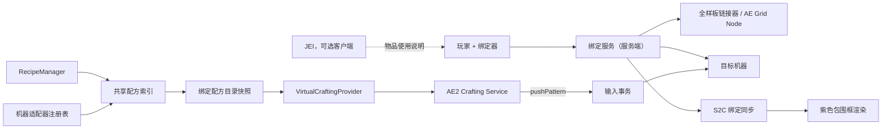

# 总体架构

## 模块边界

- `binding`：两阶段交互、服务端验证、绑定记录生命周期。
- `ae`：自有 Grid Node、`ICraftingProvider`、样板编码和刷新。
- `recipe`：服务端配方索引、规范化、指纹、重载 diff。
- `machine`：机器识别、可自动化配方、跨面输入事务与输出能力回收。
- `persistence`：带 schema 的 SavedData/Data Component 编解码和迁移。
- `network`：只同步客户端显示必需的只读状态。
- `client`：紫色框和只读客户端绑定状态。
- `compat`：按模组 ID/客户端集成生命周期加载的 Mekanism 适配器与 JEI 插件。

## 生命周期

1. 模组初始化：注册物品、链接器、数据组件、网络包和适配器工厂。
2. 世界加载：读取绑定记录，但不强制加载目标区块。
3. RecipeManager 首次可用：按适配器共享构建索引。
4. 链接器 Grid Node 上线：注册 `ICraftingProvider` 服务。
5. 绑定建立：从共享索引筛选适用配方并生成不可变目录。
6. `/reload`：清理旧 RecipeManager 代数，重建索引，按指纹 diff 后请求 AE 刷新。
7. Grid 变化：只重新挂接服务和刷新目录，不重扫所有配方。
8. 世界卸载：释放索引与客户端框缓存，不能用全局强引用留住 Level。
